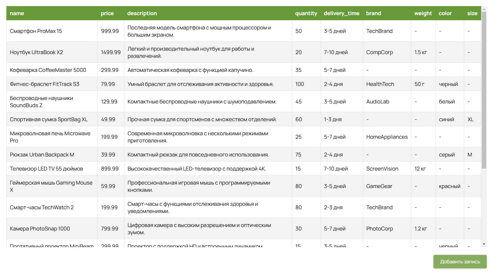
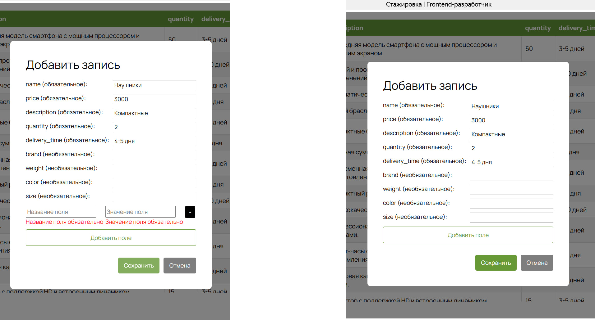

# Документация и объяснение реализации

## 1. Описание мини-приложения:

   Приложение представляет собой таблицу с возможностью динамической загрузки данных через Infinite Loader, добавления новых записей через форму с валидацией и сохранением изменений на сервере.

### **Основные функциональности:**

  - **Таблица:** Отображает данные из API (json-server) (Для API необходимо было использовать https://github.com/typicode/json-server файл с db нужно было приложить к проекту). 

- **Infinite Loader**: Решила использовать IntersectionObserver для автоматической подгрузки новых данных при достижении конца таблицы. В итоге записи, как бы по 20 штук (как батчи), подгружаются при пролистовании до конца страницы.

- **Форма создания записи**: Позволяет пользователю добавлять новые записи с произвольным количеством полей (обязательные и необязательные). Здесь я немного впала в ступор, т.к. по условию не очивидно, что именно от меня хотят, а написать в поддержку не получилось (бот, к сожалению, на такие вопросы не отвечает). Поэтому интерпретировала условие как: у нас есть поля - обязательные (можно было их задать в интерфейсе, но у меня они просто на основании json файла. Т.е. поля которые есть у всех записей - они обязательные, остальные дополнительные). Если у нас в сумме полей меньше 15 (максимальное количество), то мы может добавить еще пользовательские поля (то же самое что и необязательные) при нажатии на соответствующую кнопку или, передумав, удалить, нажав на знак "-". Возможность отмены добавления записи так же предусмотрена.

- **Валидация**: Проверяет заполненность обязательных полей и пользовательских полей. Т.е., если нажали на "добавить поле", то его обязательно нужно заполнить, как и обязательные поля.

## 2. Архитектура проекта. Выбор инструмента:

- Стейт-менеджмент

    Было решено использовать локальное состояние (useState) вместо глобального стейт-менеджера (например, Redux или Context API). 
 
  В первую очередь это из-за простоты проекта. Т.к. требуется управление только одним компонентом (DataTable) и его дочерними элементами. Так же у нас минимальное количество глобальных данных. Все данные хранятся внутри компонента DataTable, что по сути как аз и  упрощает управление состоянием.
  Плюс локальное состояние позволяет избежать ненужных перерисовок других частей приложения. То есть и производительность таким образом должна быть лучше.

